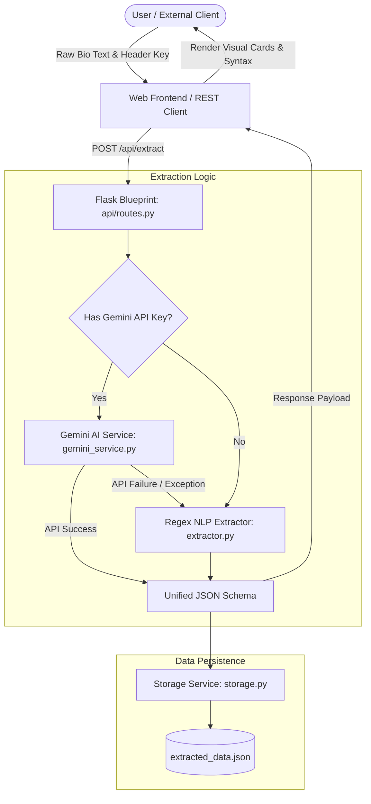

# 🧬 BioExtractor — AI-Powered Profile & Bio Parser

<p align="center">
  
  
  
  
  
</p>

<p align="center">
  <strong>Transform unstructured bios, resumes, and personal introductions into normalized, structured JSON data using Google Gemini 2.0 Flash AI with offline regex fallback.</strong>
</p>

<p align="center">
  <a href="#-overview">Overview</a> •
  <a href="#-key-features">Key Features</a> •
  <a href="#-system-architecture">Architecture</a> •
  <a href="#-tech-stack--requirements">Requirements</a> •
  <a href="#-installation--quickstart">Quickstart</a> •
  <a href="#-usage-guide">Usage</a> •
  <a href="#-rest-api-documentation">API Docs</a> •
  <a href="#-deployment">Deployment</a> •
  <a href="#-troubleshooting--faqs">Troubleshooting</a> •
  <a href="#-contributing">Contributing</a> •
  <a href="#-license">License</a>
</p>

---

## 📖 Overview

**BioExtractor** is an intelligent, privacy-first web application and RESTful service designed to convert unstructured, free-form text descriptions (such as resumes, LinkedIn bios, self-introductions, and email signatures) into structured JSON schema profiles.

Built on **Flask** and powered by **Google Gemini 2.0 Flash**, BioExtractor leverages state-of-the-art Large Language Models to identify candidate attributes, normalize technical terminology, calculate professional tenure, and categorize contact channels. To guarantee high availability, it also embeds a deterministic, offline **regular expression NLP fallback engine** capable of extracting essential profile fields even without an active internet connection or API quota.

---

## ✨ Key Features

- **🧠 Dual-Engine Parsing Architecture**:
  - **Primary**: Google Gemini 2.0 Flash AI for high-accuracy contextual understanding, semantic inference, and technology normalization.
  - **Fallback**: Local offline regex NLP engine covering 90+ programming languages, frameworks, cloud services, and degree classifications.
- **🔒 Client-First Privacy & Zero Server Retention**:
  - API keys are entered via a dedicated settings drawer and saved exclusively inside the browser's `localStorage`.
  - Keys are transmitted dynamically per-request using the `X-Gemini-API-Key` HTTP header.
  - The server configures the Gemini client dynamically without persisting credentials to disk or logs.
- **💎 Premium Glassmorphism UI**:
  - Futuristic dark dashboard featuring glowing radial gradients, fluid CSS grid card layouts, and micro-animations.
  - Responsive across desktop, tablet, and mobile displays.
- **⚡ Interactive Preset Prompts**:
  - Built-in one-click templates: *Personal Bio*, *Developer Profile*, *Designer Intro*, and *Project Manager*.
  - Live character counter and input reset tools.
- **🗃️ History Management & Local Persistence**:
  - Keeps chronological track of past extractions with auto-generated initial avatars and skill badges.
  - Individual profile deletion and one-click bulk clearing.
  - Profiles are persisted locally to `extracted_data.json`.
- **📥 Data Export & Instant Clipboard**:
  - Download all profile extractions as an `extracted_profiles.json` file attachment.
  - One-click raw JSON copy to system clipboard with interactive toast alerts.
- **🔌 Decoupled RESTful API**:
  - Fully functional JSON endpoints for programmatic integration into external scrapers, HR pipelines, and candidate databases.

---

## 🏗️ System Architecture

### Processing Pipeline



### Extracted Profile Schema

BioExtractor maps any unstructured paragraph into the following standardized schema:

| Field | Type | Description | Example |
| :--- | :--- | :--- | :--- |
| `name` | `string \| null` | Candidate full name | `"Ganesh S"` |
| `role` | `string \| null` | Professional title or job role | `"Full Stack Developer"` |
| `experience` | `string \| null` | Normalized duration of experience | `"7 years"` |
| `company` | `string \| null` | Organization or employer name | `"Tech Solutions Inc."` |
| `tech_stacks` | `array<string> \| null` | Normalized tools, languages, and frameworks | `["Python", "React", "Docker"]` |
| `education` | `array<string> \| null` | Degrees and academic qualifications | `["B.Tech", "Computer Science"]` |
| `location` | `string \| null` | City, state, or country | `"Chennai"` |
| `email` | `string \| null` | Valid email address | `"developer@example.com"` |
| `phone` | `string \| null` | Contact phone number | `"+91 9876543210"` |
| `linkedin` | `string \| null` | LinkedIn profile URL | `"https://linkedin.com/in/ganesh"` |
| `github` | `string \| null` | GitHub profile URL | `"https://github.com/Ganesh030106"` |
| `interests` | `array<string> \| null` | Hobbies and secondary interests | `["Open Source", "Robotics"]` |
| `raw_text` | `string` | Original input bio text | `"My name is..."` |
| `timestamp` | `string` | ISO-formatted extraction datetime | `"2026-10-04 22:00:00"` |
| `extracted_by`| `string` | Engine utilized (`"gemini"` or `"regex"`) | `"gemini"` |

---

## 📁 Project Directory Structure

```plaintext
BioExtractor/
├── .env.example              # Template for environment configuration
├── .gitignore                # Git ignore rules (venv, cache, secrets)
├── app.py                    # Flask application entry point & root route
├── requirements.txt          # Python production dependencies
├── extracted_data.json       # Local persistence file for profile history
├── LICENSE                   # MIT open-source license
├── README.md                 # Project documentation
│
├── api/
│   ├── __init__.py           # API package marker
│   └── routes.py             # Flask Blueprint defining all REST API endpoints
│
├── config/
│   ├── __init__.py           # Config package marker
│   └── settings.py           # Environment variables and constants loader
│
├── services/
│   ├── __init__.py           # Services package marker
│   ├── gemini_service.py     # Google Gemini 2.0 Flash AI extraction engine
│   ├── extractor.py          # Regex-based pattern matching fallback engine
│   └── storage.py            # JSON file read/write persistence handler
│
├── static/
│   ├── script.js             # Client interactivity, API handler, history UI
│   └── style.css             # Glassmorphism design system & micro-animations
│
└── templates/
    └── index.html            # Main single-page application dashboard
```

---

## 💻 Tech Stack & Requirements

### Core Requirements
- **Python**: `3.10` or higher
- **Package Manager**: `pip`
- **Google Gemini API Key**: Optional for regex fallback, required for AI extraction ([Get a free key at Google AI Studio](https://aistudio.google.com/apikey))
- **Web Browser**: Any modern browser (Chrome, Edge, Firefox, Safari)

### Dependencies Breakdown

| Library | Version | Purpose |
| :--- | :--- | :--- |
| **Flask** | `3.1.0` | Lightweight WSGI web framework and API router |
| **Flask-CORS** | `5.0.1` | Cross-Origin Resource Sharing for API flexibility |
| **google-generativeai** | `0.8.5` | Official Google SDK for Gemini LLMs |
| **python-dotenv** | `1.1.0` | Loads environment configurations from `.env` |
| **gunicorn** | `23.0.0` | Production WSGI HTTP server for Unix deployments |

---

## 🚀 Installation & Quickstart

Follow these step-by-step instructions to get BioExtractor running on your local machine:

### 1. Clone the Repository

```bash
git clone https://github.com/Ganesh030106/BioExtractor-.git
cd BioExtractor
```

### 2. Set Up a Virtual Environment

**Windows (PowerShell):**
```powershell
python -m venv .venv
.\.venv\Scripts\Activate.ps1
```
*(If PowerShell displays an `ExecutionPolicy` error, run `Set-ExecutionPolicy -Scope Process -ExecutionPolicy RemoteSigned` first).*

**Windows (Command Prompt):**
```cmd
python -m venv .venv
.\.venv\Scripts\activate.bat
```

**macOS / Linux (Bash/Zsh):**
```bash
python3 -m venv .venv
source .venv/bin/activate
```

### 3. Install Required Dependencies

```bash
pip install -r requirements.txt
```

### 4. Configure Environment Variables

Copy the provided sample configuration:

**Windows (PowerShell):**
```powershell
Copy-Item .env.example .env
```

**Linux / macOS:**
```bash
cp .env.example .env
```

You can optionally define a server-level Gemini API key in `.env`:
```ini
GEMINI_API_KEY=""
GEMINI_MODEL="gemini-2.0-flash"
APP_PORT=5000
DEBUG_MODE=true
```
> [!NOTE]
> Specifying `GEMINI_API_KEY` on the server is entirely optional. Users can securely provide their own keys in the frontend settings drawer without saving anything to the host server.

### 5. Launch the Application

```bash
python app.py
```

Open your browser and navigate to:
```
http://localhost:5000
```

---

## 🖥️ Usage Guide

### Using the Web Interface

1. **Configure API Key (Recommended)**:
   - Click the **Gear icon (⚙️)** in the top navigation bar to open the **API Credentials** drawer.
   - Enter your personal Google Gemini API key (starts with `AIzaSy...`).
   - Click **Save Settings**. The key is saved safely in your browser's `localStorage`.
2. **Submit Input Text**:
   - Type or paste an unstructured biography, resume snippet, or profile summary into the text area.
   - Or click any of the preset chips: **👤 Personal Bio**, **💻 Developer Profile**, **🎨 Designer Intro**, or **📊 Project Manager**.
3. **Extract & Inspect Data**:
   - Click **Extract Data**.
   - Within seconds, view your structured card grid displaying individual badges for tech stacks, contact links, experience, and education.
   - Scroll to the bottom of the section to view syntax-highlighted JSON.
   - Click **Copy JSON** to copy the formatted output directly to your clipboard.
4. **Manage History**:
   - Click the **History** tab in the top header.
   - Browse prior extraction snapshots, view extracted roles, delete individual entries, or click **Clear All**.
   - Click the **Export All Data** icon in the header to download your entire history in JSON format.

---

## 📡 REST API Documentation

BioExtractor provides a clean RESTful interface allowing developers to automate profile extraction from external applications.

### Base URL
```
http://localhost:5000/api
```

### Endpoints Overview

| Method | Endpoint | Description | Auth / Headers |
| :--- | :--- | :--- | :--- |
| `GET` | `/api/status` | Check if Gemini AI is active or running in fallback mode | None |
| `POST` | `/api/extract` | Parse submitted unstructured text into structured profile | Optional `X-Gemini-API-Key` |
| `GET` | `/api/history` | Retrieve all historical extractions | None |
| `DELETE` | `/api/delete/<int:index>` | Delete an extraction entry by index | None |
| `DELETE` | `/api/clear` | Clear all entries from history | None |
| `GET` | `/api/export` | Download full dataset as an attached JSON file | None |

---

### API Usage Examples

#### 1. Extract Profile (`POST /api/extract`)

##### Using cURL:
```bash
curl -X POST http://localhost:5000/api/extract \
  -H "Content-Type: application/json" \
  -H "X-Gemini-API-Key: YOUR_GEMINI_API_KEY" \
  -d '{
    "text": "My name is Ganesh, a Full Stack Developer from Chennai with 7 years of experience. I work with Python, React, Flask, and Docker. Contact me at ganesh.s030106@gmail.com or https://github.com/Ganesh030106."
  }'
```

##### Using Python (`requests`):
```python
import requests

url = "http://localhost:5000/api/extract"
headers = {
    "Content-Type": "application/json",
    "X-Gemini-API-Key": "YOUR_GEMINI_API_KEY"
}
payload = {
    "text": "My name is Ganesh, a Full Stack Developer from Chennai with 7 years of experience. I work with Python, React, Flask, and Docker."
}

response = requests.post(url, json=payload, headers=headers)
data = response.json()
print(data)
```

##### Using JavaScript (`fetch`):
```javascript
const response = await fetch("http://localhost:5000/api/extract", {
  method: "POST",
  headers: {
    "Content-Type": "application/json",
    "X-Gemini-API-Key": "YOUR_GEMINI_API_KEY"
  },
  body: JSON.stringify({
    text: "My name is Ganesh, a Full Stack Developer from Chennai with 7 years of experience."
  })
});

const result = await response.json();
console.log(result.extracted);
```

##### Sample API Response:
```json
{
  "success": true,
  "total_entries": 1,
  "extracted": {
    "name": "Ganesh",
    "role": "Full Stack Developer",
    "experience": "7 years",
    "company": null,
    "tech_stacks": [
      "Docker",
      "Flask",
      "Python",
      "React"
    ],
    "education": null,
    "location": "Chennai",
    "email": "ganesh.s030106@gmail.com",
    "phone": null,
    "linkedin": null,
    "github": "https://github.com/Ganesh030106",
    "interests": null,
    "raw_text": "My name is Ganesh, a Full Stack Developer from Chennai with 7 years of experience...",
    "timestamp": "2026-10-04 22:05:00",
    "extracted_by": "gemini"
  }
}
```

---

## 🚢 Deployment

### 1. Production WSGI Server (Gunicorn)

On Unix/Linux production servers, execute:
```bash
gunicorn -w 4 -b 0.0.0.0:8000 app:app
```
*(Tip: Set `-w` to `2 * (CPU Cores) + 1` for optimal throughput).*

---

### 2. Containerized Deployment with Docker

#### Create a `Dockerfile`:
```dockerfile
FROM python:3.11-slim

# Prevent Python from writing .pyc files & enable unbuffered stdout
ENV PYTHONDONTWRITEBYTECODE=1
ENV PYTHONUNBUFFERED=1

WORKDIR /app

# Install system dependencies
RUN apt-get update && apt-get install -y --no-install-recommends gcc && rm -rf /var/lib/apt/lists/*

# Install application dependencies
COPY requirements.txt .
RUN pip install --no-cache-dir -r requirements.txt

# Copy application source
COPY . .

# Expose standard application port
EXPOSE 5000

# Start Gunicorn server
CMD ["gunicorn", "-w", "4", "-b", "0.0.0.0:5000", "app:app"]
```

#### Build and Run:
```bash
# Build Docker image
docker build -t bioextractor .

# Run Docker container
docker run -d -p 5000:5000 --name bioextractor-app bioextractor
```

---

### 3. Deploying to Cloud Services (e.g., Render)

1. Fork or push this repository to GitHub.
2. Log in to [Render](https://render.com) and create a **New Web Service**.
3. Link your repository.
4. Fill in the build settings:
   - **Environment**: `Python 3`
   - **Build Command**: `pip install -r requirements.txt`
   - **Start Command**: `gunicorn app:app`
5. Click **Create Web Service**.

---

## ❓ Troubleshooting & FAQs

<details>
<summary><strong>1. Why is the engine reporting "regex" instead of "gemini"?</strong></summary>

- Check if you have entered an API key under **API Settings** (gear icon) in the frontend, or configured `GEMINI_API_KEY` in your `.env` file.
- Verify that your API key is active and not rate-limited or restricted in the [Google AI Studio Console](https://aistudio.google.com/apikey).
- If the Gemini API request encounters a network error or invalid JSON response, the system seamlessly falls back to the deterministic regex engine.
</details>

<details>
<summary><strong>2. How do I fix "ExecutionPolicy" errors on Windows PowerShell?</strong></summary>

When activating `.venv\Scripts\Activate.ps1`, PowerShell might block scripts by default. Run:
```powershell
Set-ExecutionPolicy -Scope Process -ExecutionPolicy RemoteSigned
```
Then rerun the activation script.
</details>

<details>
<summary><strong>3. Port 5000 is already in use</strong></summary>

On macOS (Monterey and later), AirPlay Receiver listens on port 5000 by default. You can change the port in `.env`:
```ini
APP_PORT=5001
```
Or run Flask on another port:
```bash
python -c "from app import app; app.run(port=5001)"
```
</details>

<details>
<summary><strong>4. Is my personal Gemini API key stored on your servers?</strong></summary>

No. When entered in the frontend UI, your key is saved exclusively in your browser's `window.localStorage`. It is sent with each request as an HTTP header (`X-Gemini-API-Key`) and used in memory for that single call without being recorded in databases or persistent logs.
</details>

---

## 🤝 Contributing

Contributions make the open-source community an inspiring place to learn, create, and build. Any contributions you make are **greatly appreciated**!

1. **Fork the Repository**
2. **Create a Feature Branch**:
   ```bash
   git checkout -b feature/AmazingFeature
   ```
3. **Commit your Changes**:
   ```bash
   git commit -m "Add some AmazingFeature"
   ```
4. **Push to the Branch**:
   ```bash
   git push origin feature/AmazingFeature
   ```
5. **Open a Pull Request**

### Code Standards
- Ensure PEP 8 compliance for Python code.
- Test your changes against both the Gemini AI extractor and the fallback regex service.
- Keep frontend styles consolidated inside `static/style.css`.

---

## 📄 License

Distributed under the **MIT License**. See [`LICENSE`](file:///f:/Projects/BioExtractor/LICENSE) for more information.

---

## 👏 Credits & Acknowledgments

- [Google Generative AI](https://ai.google.dev/) for the Gemini 2.0 Flash API.
- [Flask](https://palletsprojects.com/p/flask/) by the Pallets team.
- [Google Fonts](https://fonts.google.com/) for the *Inter* and *JetBrains Mono* typefaces.
- SVG Iconography inspired by [Feather Icons](https://feathericons.com/) and [Lucide](https://lucide.dev/).

---

## 📬 Contact & Support

**Ganesh S**  
- **GitHub**: [@Ganesh030106](https://github.com/Ganesh030106)
- **Repository**: [BioExtractor-](https://github.com/Ganesh030106/BioExtractor-)
- **Email**: [ganesh.s030106@gmail.com](mailto:ganesh.s030106@gmail.com)

If you find this project helpful, please consider giving it a ⭐ on GitHub!
